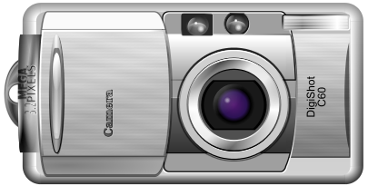

:name: svgren

= {name}

|====
| link:https://github.com/cppfw/{name}/releases[image:https://img.shields.io/github/tag/cppfw/{name}.svg[releases]] | link:https://github.com/cppfw/{name}/actions[image:https://github.com/cppfw/{name}/workflows/ci/badge.svg[ci status]] | link:https://codecov.io/gh/cppfw/{name}[image:https://codecov.io/gh/cppfw/{name}/branch/main/graph/badge.svg?token=vwqhr1CujV[codecov.io]]
|====

SVG renderer library in C++.

**{name}** uses **link:https://github.com/cppfw/svgdom[svgdom]** to read the SVG file and **link:http://github.com/cppfw/agg[AGG]** to render graphics.

= Installation and Tutorials
Read link:wiki/Main.adoc[WiKi] for installation instructions and tutorials.

= Projects using {name}
link:wiki/usages.adoc[See list here].
